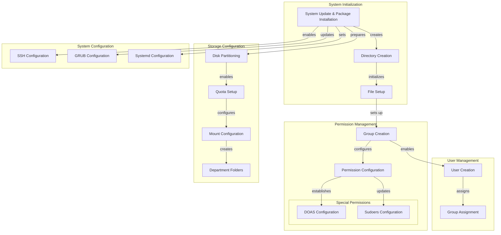

```mermaid
graph TB
    subgraph "System Initialization"
        init["System Update & Package Installation"]
        folderSetup["Directory Creation"]
        fileSetup["File Setup"]
    end

    subgraph "Permission Management"
        groupSetup["Group Creation"]
        permConfig["Permission Configuration"]
        subgraph "Special Permissions"
            doasConfig["DOAS Configuration"]
            sudoConfig["Sudoers Configuration"]
        end
    end

    subgraph "User Management"
        userCreation["User Creation"]
        userGroups["Group Assignment"]
    end

    subgraph "Storage Configuration"
        diskSetup["Disk Partitioning"]
        quotaSetup["Quota Setup"]
        mountConfig["Mount Configuration"]
        deptFolders["Department Folders"]
    end

    subgraph "System Configuration"
        sshConfig["SSH Configuration"]
        grubConfig["GRUB Configuration"]
        systemdConfig["Systemd Configuration"]
    end

    %% Flow Connections
    init -->|"creates"| folderSetup
    folderSetup -->|"initializes"| fileSetup
    fileSetup -->|"sets up"| groupSetup

    groupSetup -->|"configures"| permConfig
    permConfig -->|"establishes"| doasConfig
    permConfig -->|"updates"| sudoConfig

    groupSetup -->|"enables"| userCreation
    userCreation -->|"assigns"| userGroups

    init -->|"prepares"| diskSetup
    diskSetup -->|"enables"| quotaSetup
    quotaSetup -->|"configures"| mountConfig
    mountConfig -->|"creates"| deptFolders

    init -->|"enables"| sshConfig
    init -->|"updates"| grubConfig
    init -->|"sets"| systemdConfig
```

