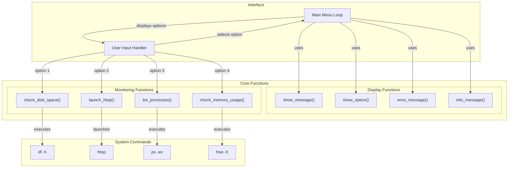

```mermaid
graph TB
    subgraph "Interface"
        mainMenu["Main Menu Loop"]
        userInput["User Input Handler"]
    end

    subgraph "Core Functions"
        subgraph "Display Functions"
            showMessage["show_message()"]
            showOption["show_option()"]
            errorMessage["error_message()"]
            infoMessage["info_message()"]
        end

        subgraph "Monitoring Functions"
            diskSpace["check_disk_space()"]
            htopMonitor["launch_htop()"]
            processList["list_processes()"]
            memoryUsage["check_memory_usage()"]
        end
    end

    subgraph "System Commands"
        dfCommand["df -h"]
        htopCommand["htop"]
        psCommand["ps -eo"]
        freeCommand["free -h"]
    end

    %% Menu Flow
    mainMenu -->|"displays options"| userInput
    userInput -->|"selects option"| mainMenu

    %% Display Function Connections
    mainMenu -->|"uses"| showMessage
    mainMenu -->|"uses"| showOption
    mainMenu -->|"uses"| errorMessage
    mainMenu -->|"uses"| infoMessage

    %% Monitoring Function Flows
    userInput -->|"option 1"| diskSpace
    userInput -->|"option 2"| htopMonitor
    userInput -->|"option 3"| processList
    userInput -->|"option 4"| memoryUsage

    %% System Command Connections
    diskSpace -->|"executes"| dfCommand
    htopMonitor -->|"launches"| htopCommand
    processList -->|"executes"| psCommand
    memoryUsage -->|"executes"| freeCommand
```